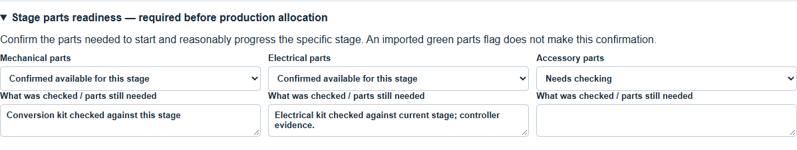
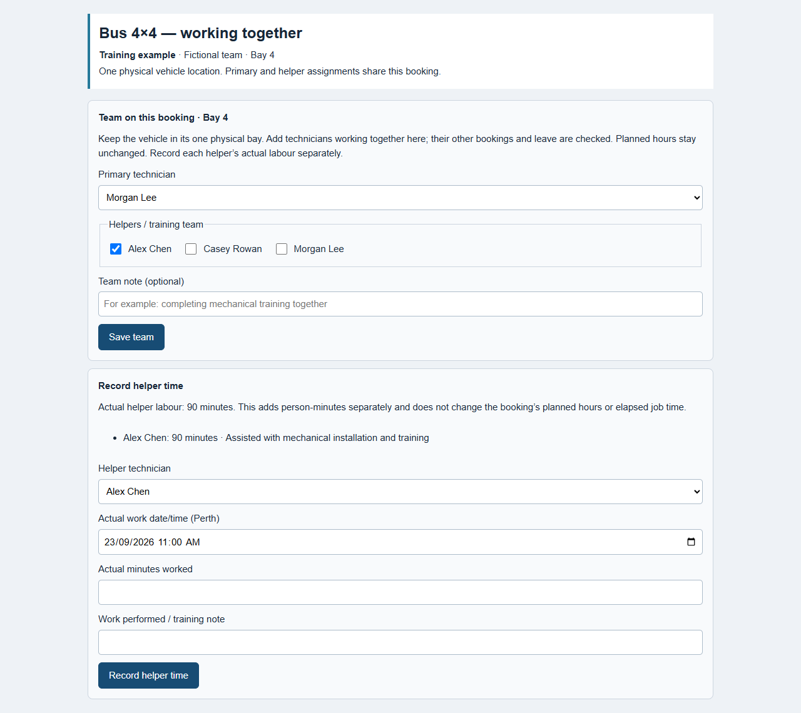
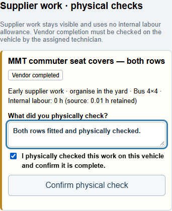
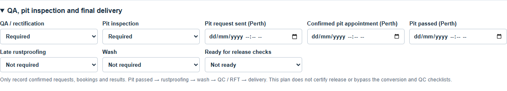
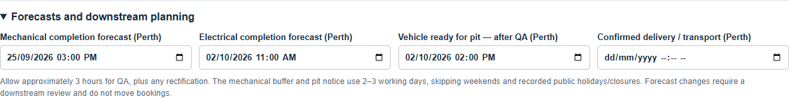

# Bus4x4 board: from import to delivery

Working guide for Bhavesh and the Department 138 team · 23 September 2026

This guide follows the Department 138 workshop controls. Pictures use training examples of the actual controls; they do not record work on a customer vehicle.

Open [the staging board](https://btnew.github.io/pdc-control-board-staging/) and press Ctrl+F5 on a Windows computer to load the latest version. On an iPad, reload the page. Sign in with your own staff account. The controller uses Bus 4×4 under Workshop Planners; technicians use Fitters bay.

## The three things to keep separate

- The vehicle's location tells you where the vehicle is recorded: for example, Yard Hold, PMB or RFT.
- The bay booking reserves a physical bay and a technician for a period. A planned booking does not mean work has started.
- Workshop flow records the build stage, dependencies, parts checks and forecasts. Saving this panel does not create a booking, send a supplier request or certify completion.

A vehicle in Vehicle Locations → PMB is not automatically allocated to a technician. It still needs approved outstanding workshop work, supported hours, stage-parts readiness and an available bay booking.

One vehicle has one physical bay position at a time. If two people work together on it, record the primary technician and helpers against that one booking. Do not create a second overlapping vehicle booking in the other person's normal bay.

## Daily start: a five-minute check

1. Open Bus 4×4, press Refresh Vehicle, and check the selected date.
2. Check the Unallocated vehicles list and search for the next job by its full job-card number, stock or key.
3. Open the vehicle's Workshop flow / parts readiness. Review the current stage, outstanding dependencies, supplier work and forecasts.
4. Check today's bay and technician availability. Production must skip workshop closures, public holidays and recorded leave.
5. Resolve urgent parts, supplier or forecast warnings before promising a start or finish.

## 1. Receive the vehicle and review its job

Where: New Vehicles, then Review on the vehicle.

1. Check the stock, linked job card, model, customer, location and vehicle identity before editing anything. Use the actual job-card number as well as the stock when several jobs belong to one vehicle.
2. Read every operation description. Department 138 window tint goes to Tint; other Department 138 work stays in Bus 4×4. A tinted weather shield or bonnet protector is not window tint.
3. Check the hours. Missing-hour items appear first within their station. Orange AI estimate means an estimate to review; it is not a measured actual time or a time supplied by Tune. Keep explicit Tune hours and workshop-approved corrections unless you are deliberately reviewing them.
4. Enter a supported estimate for a red missing-hours field. Use the operation's actual scope, the approved workshop standards and the current ARB fitting reference where applicable. Do not enter a tiny number merely to bypass the review.
5. Check supplier work separately. Supported supplier placeholders remain visible against the vehicle but do not consume normal internal scheduling labour. An arbitrary small estimate alone does not prove the job is supplier work.
6. Select Approve & add to board when the review is complete. The list may also offer Approve to board for a ready vehicle.

What approval does: saves the reviewed operations and hours and makes the vehicle available on the board at its current location. It does not book a bay, start work or mark an item fitted.

What holds approval: an unresolved identity, an unassigned operation, missing required hours, an operation that changed during review, or an account without approval permission. Resolve the message shown; do not recreate the vehicle to get around it.

If an already-approved job receives a new or changed Tune line, review it in Updated Operations. Approve change & update bookings is a different action: it can adjust affected booking durations and later queues. Read its booking-time summary before continuing. This differs from merely changing a forecast in Workshop flow.

### Arrival details and early supplier work

Check the arrival/Cars In information against the exact vehicle. The report's Block Number is the vehicle key number; Tag # is the parts location. Give suppliers the key together with the stock or registration, not the key alone.

Organise tint, signage, flares/hatch covers and seat covers while the vehicle is waiting in the yard where possible. MMT's approximate first-week timing is planning guidance; it is not a confirmed appointment.

## 2. Check parts before allocating a production bay

Where: Bus 4×4 → Workshop flow / parts readiness → Stage parts readiness — required before production allocation.

There are separate checks for Mechanical parts, Electrical parts and Accessory parts.

1. Check the parts needed to start and reasonably progress the particular stage.
2. Select Confirmed available for this stage only after that check.
3. Enter a note under What was checked / parts still needed. State what is available and any relevant limitation. A readiness confirmation needs evidence, not just a dropdown selection.
4. Select Save workshop flow and wait for confirmation.
5. If the stage cannot reasonably proceed, select Parts outstanding, record what is missing, and keep the job waiting rather than occupying a production bay.

The parts pill and the stage readiness check answer different questions. Imported green or a person-confirmed green outline does not automatically complete the mechanical/electrical/accessory readiness form.

### Reading the parts pill

| Appearance or wording | Meaning | What you should do |
|---|---|---|
| Orange: parts outstanding | At least one relevant active job has a recorded backorder. A PO may be recorded for at least one outstanding part, not necessarily all. | Open the job-level details and identify the affected R/O and missing items. |
| Green from a parts import | The saved active jobs meet the recorded parts rules. | Still check physical readiness for the production stage. |
| Green with a dark green outline | A person has confirmed the parts are here; the confirmation evidence is retained. | Read the confirmation's scope. It is not permission to tick fitted work or supplier installation. |
| Grey / needs review | No attached parts recorded, or readiness remains unresolved. | Check whether parts are required; labour-only work may need no parts. |
| Invalid/unknown report data | The latest row could not safely replace the prior status. | Review the issue. Blank, “All” and unexpected flag values are not treated as zero. |

Parts remain separate for each R/O. One complete R/O does not clear another linked active R/O's outstanding parts. A parts-only report never creates a vehicle, operation or booking.

## 3. Find the job in Unallocated

Where: Bus 4×4 → Unallocated vehicles, or Find a workshop booking.

Search by the full job card, stock or key. The search can also locate a job already booked outside the day you are viewing. Select the returned booking to see its actual position.

A job appears as unallocated when it has approved, active, outstanding work for this station and that work is not already represented by an active booking. Its location must be eligible. The current planner admits PMB and Yard Hold; an In Transit vehicle needs a valid Kewdale ETA and is subject to the displayed ETA-plus-seven-days planning limit.

Already booked work belongs on the planner rather than appearing as another bookable copy in Unallocated. Completed, checked-out, deleted, unapproved or identity-held records must not be recreated simply because they are absent from this list.

If you can see a vehicle in PMB but not in Unallocated:

1. Clear the search, use Refresh Vehicle, and confirm the Department 138/Bus 4×4 context.
2. Search its job card and stock. Check for an existing booking on another date or bay.
3. Check New Vehicles and Updated Operations for outstanding review.
4. Check whether Bus 4×4 work is actually still required and incomplete, and whether the source job is active.
5. Read the disabled card's reason, such as Hours unknown, an ETA issue or Already booked.
6. If the exact job is still missing, email pmbcontroller@gmail.com with the stock, R/O, key and screenshot. Do not change checkout status or create a duplicate as a workaround.

## 4. Allocate the first bay and technician

Where: the vehicle's Schedule button in Bus 4×4.

1. Complete and save the appropriate stage parts readiness check.
2. Select Schedule.
3. Choose the physical Bay, Date, Start time and Technician.
4. Review Planned hours. These come from the approved operation estimate and scheduling settings; supplier placeholders should not add internal labour. A read-only field is not an invitation to edit source hours elsewhere just to fit a slot.
5. Select Add to planner. Wait for the saved result, then check the job appears in the intended bay, under the intended technician, on the intended date.

Best slot offers the earliest suitable availability. You can also drag an unallocated vehicle onto a bay/time. Review any proposed movement of later planned jobs. Running or stopped work cannot be silently overwritten. A bay default is a convenience; the actual technician on this booking is what matters.

### Choosing the bay

| Bay | Normal use and technician | Important condition |
|---|---|---|
| 1 | James Ierino — mechanical | HiAce or Coaster; supervised training as needed. |
| 2 | Paul Guiye — mechanical | HiAce or Coaster; training under Andrew. |
| 3 | John Castagna — mechanical | HiAce only. No Coaster because of height restrictions. |
| 4 | Ren Karlos — mechanical/fabrication | HiAce or Coaster; training under Andrew. |
| 5–6 | Non-hoist accessory, progression or waiting | Use deliberately for the next work or waiting stage. |
| 7 | Flexible QA, urgent work and rectification | Andrew's controller/QA role remains flexible. |
| 8 | Nick Darker — electrical lead | HiAce, Coaster and light vehicles. |
| 9 | Gabriel Colborne — electrical/fitment | Work under Nick's direction. |
| 10 | Mudassar Rasheed — accessory/mine-spec fitout | Light vehicles, HiAce or Coaster as appropriate; major wiring under Nick. |

Electrical/accessory work can run in Bays 8, 9 and 10. Nick's main bay is not a restriction confining all electrical work to Bay 8.

Normal weekdays are 06:00–15:00 for the mechanical team and Mudassar; 06:00–14:00 for Nick and Gabriel. Keep Nick's full available productive shift; do not apply an extra supervision deduction. Recorded breaks, leave and closures still apply. Public holidays/workshop closures must have no production hours allocated.

### Two technicians on one build

Use Team on this booking to keep the actual crew together on one physical booking.

- Keep one booking in the bay where the vehicle is physically standing.
- Record one primary technician and the additional helpers on that same booking.
- Supervision alone does not require assigning Andrew to the booking. Selecting him as primary or helper reserves him for the whole booking; there is no partial-shift helper reservation control.
- Check every selected person's availability. A helper cannot also be committed to an overlapping job elsewhere.
- Do not halve the approved conversion allowance merely because two people are present. Record helper labour separately from main-technician conversion time.

Allocate the vehicle to its actual physical bay, select that booking, open Team on this booking, select the primary technician and helper(s), then select Save team. Refresh the saved booking and check the team and physical bay before work starts. For example, two people working together in Bay 4 belong on one Bay 4 booking, regardless of their usual bays.

Controllers and administrators can save the team. Each assigned technician can find the same booking in Fitters bay under their own name. Work progress belongs to the one job; do not restart a second timer or create duplicate bookings.

To record helper labour, the controller opens Record helper time after the job has started. Choose Helper technician, enter Actual work date/time (Perth), Actual minutes worked and Work performed / training note, then select Record helper time. Record actual time only, using a date/time within both the helper assignment and the started booking period. Record accrued helper time before releasing the booking to Unallocated where possible; it can also be entered after restart or completion using the original work time. This is stored separately from the main-technician allowance and does not shorten or extend the booking automatically. If the save is uncertain, use Retry helper time save and check the saved result before entering another record.

## 5. Start work and use the bay iPad

Where: Fitters bay.

1. Sign in and choose your name in Mechanic.
2. Check the stock, job card, vehicle, bay and scheduled work. A booking-specific technician assignment overrides the bay default.
3. Press Start job when you physically begin. Wait for In progress and a connected/saved state before recording work.
4. Read each operation. Tick it only after that item is actually finished. Other stations' items may be visible as context without being editable here.
5. Add and save an operation note when you need to explain incomplete work, a finding or a handover.
6. If work stops, choose Parts / other stoppage, select Parts or Other, explain What is holding up the work?, then Record stoppage. Use Resume job when work genuinely resumes.

The Department 138 timer follows recorded work in the actual bay and pauses for recorded Unallocated waiting, stoppages, breaks and workshop closure. If earlier timing history cannot be verified, it shows Progress update required instead of an invented elapsed time. Elapsed time belongs to its booking. Resuming the same booking retains that history; creating a separate booking does not merge the earlier clock into it. It does not automatically divide total time among conversion sections. Keep section actuals, helper labour and delays separate.

### Physically check supplier work

Under Supplier work · physical checks, inspect the item on the actual vehicle. A controller records Required → Ordered → Vendor completed with supplier/order/completion evidence using Save supplier progress.

The assigned technician, after starting the job, records What did you physically check?, ticks I physically checked this work on this vehicle and confirm it is complete, then selects Confirm physical check. This creates Technician verified. Leave missing or unfinished work outstanding and tell the controller. A vendor's “done” email is not the physical check.

### Tick a conversion section, not the whole conversion early

The main conversion operation opens the model's checklist automatically for a supported exact match:

| Model | Main-technician planning allowance |
|---|---|
| HiAce Commuter | 38 hours, including 5 hours pre-assembly |
| Coaster | 62 hours 45 minutes, including 7 hours 30 minutes pre-assembly |

Open the relevant section. Select Current section / in progress, enter cumulative Actual main-technician hours and Estimated hours remaining, and record any Blocker, Deferred tightening, connections or checks and Workshop update / completion evidence. Select Save section update.

Tick Section completed — workshop confirmed only when that section is done. Pre-assembly already completed can be confirmed individually; it then contributes no remaining work. If its actual time is unknown, leave it unknown rather than copying the allowance.

The parent conversion becomes complete only when all required sections are confirmed. Section 12 still requires the applicable manufacturer completion-checklist reference/scope and the technician's actual completion checks. An imported complete status does not replace these checks. Additional repairs, rework, helper labour and waiting are recorded separately.

## 6. Mechanical handover, buffer and electrical

Where: Bus 4×4 → Workshop flow / parts readiness and the existing booking.

1. When mechanical work is actually finished, save its completion forecast/update and choose Buffer / wheel alignment as the current stage, with Electrical as the next stage.
2. Record wheel alignment, rectification or delayed supplier work under Waiting reason / outstanding dependency and controller notes. Plan approximately 2–3 working days before electrical, subject to real readiness and availability.
3. Arrange alignment and supplier work through the normal controller process. Saving a date or note in Workshop flow does not contact the supplier.
4. Move the existing open booking using the planner's move controls, or drag it to Return to Unallocated to release the bay while keeping work open. For a started job, choose Just move or STOPPAGE as appropriate; use STOPPAGE when there is an actual wait/blocker and record its reason. A planned booking has a simpler return confirmation. A direct move retains its primary/helpers; returning to Unallocated releases assignments, so select the team again at the next allocation.
5. Before electrical, confirm readiness for the destination bay: Electrical parts for Bays 8/9; Accessory parts for Bay 10. Choose an available compatible bay and technician under Nick's direction, then confirm the saved booking and Team on this booking.
6. Set current stage Electrical and record the electrical completion forecast. The technician completes final wiring, connections and checks; mechanically running a loom did not complete these items.

Saving Buffer in Workshop flow alone does not pause a timer or release the bay. Record the actual booking move or stoppage separately.

Do not use “Complete bay job” simply to end the mechanical phase if Bus 4×4 operations remain unfinished. Department 138 mechanical and electrical work share the Bus 4×4 station. Keep unfinished operations and conversion sections open while the physical bay/technician and workflow stage change.

When every item required for that bay job is genuinely complete, use the fitter's Complete bay job action (or its next-job variant). Completion remains separate from QC. The next assigned job may then open automatically; do not start it until ready.

## 7. QA and pit inspection

Where: Workshop flow / parts readiness → QA, pit inspection and final delivery.

1. After electrical, set Current stage → QA / rectification and set QA / rectification → In progress when inspection starts.
2. Allow approximately 3 hours per vehicle for QA planning, adjusting for the build and actual findings. The 3-hour planning default is not proof that QA occurred and should not overwrite an explicitly approved operation estimate.
3. Keep rectification open until finished. Set QA Completed only on confirmed completion.
4. Enter a credible Vehicle ready for pit — after QA (Perth) forecast. This is readiness for the pit, not the final delivery promise.
5. Contact Ron with approximately 48–72 hours notice, normally 2–3 working days, once electrical and QA forecasts are reliable.  The reminder skips weekends and recorded public holidays/workshop closures.
6. Select Requested — awaiting booking and enter Pit request sent only after the request was actually made.
7. Select Booking confirmed and enter Confirmed pit appointment only after receiving confirmation.
8. Select Passed — result confirmed and record Pit passed only after the actual successful result. Retain a note/reference for the result.

Record physical movement separately: To PIT is available from an eligible PMB Unallocated row; use Return to PMB only when the vehicle actually returns. A row already meeting the QC gate may instead show Ready for QC.

Pit inspection is a workflow milestone; it is not a separate internal workshop station to invent. A request, a forecast and a confirmed appointment are three different states.

## 8. Rustproofing, wash, QC/RFT and delivery

Late rustproofing: after pits, set the corresponding workshop stage. Record whether it is required, ordered or vendor-completed with the supporting supplier evidence. Complete any required physical verification on the supplier line. Do not record a physical return just because a supplier gives an ETA.

Wash: arrange it once preceding work is ready. Set Wash → Requested when requested, and Completed after confirmation. Leave unresolved rework or supplier checks visible.

Release preparation: choose Ready for release checks → Ready for existing QC / RFT checks only when ready for that independent inspection. This is a planning status; it does not sign the vehicle off.

QC Sign-off: the actual QC process checks every required operation, parts readiness and the vehicle's eligible location/status. The vehicle must meet the existing QC gate, including required workshop work complete and return to PMB Unallocated. From the eligible PMB row, select Ready for QC, then Open QC finalization. The authorised inspector checks the items, saves the required completion photo, then uses Sign off QC → RFT. If something is wrong, use the available rejection action and identify the items/faults; rectification remains visible. Finishing fitter work does not perform QC.

Delivery / transport: record the confirmed date under Confirmed delivery / transport (Perth) and set the workflow stage when appropriate. Use the established RFT/collection process for the actual handover. A delivery forecast alone does not prove collection, delivery or completion. Do not use an import status as a shortcut around unfinished conversion or QC checks.

## 9. Forecasts and downstream reminders

Workshop flow has four date/time fields: mechanical completion, electrical completion, vehicle ready for pit after QA, and confirmed delivery/transport. Enter the current best supported dates, in Perth time, and explain significant changes in Controller planning notes / reason for changed forecasts.

The panel uses these forecasts to highlight the buffer, pit-request timing and a delivery risk. It flags downstream review when a forecast changes. Save the changed forecast first; then review electrical, QA, pit, rustproofing, wash and delivery arrangements and acknowledge the downstream-review checkbox when they have actually been checked.

A forecast change does not silently reschedule bookings. Inspect and change the actual planner/supplier arrangements separately. By contrast, an explicit scheduling move or approved operation-hours update can move affected planned work; review the saved result.

The conversion checklist has a separate remaining-work assessment. It needs a promised completion date, workshop-confirmed available main-technician capacity, actual section progress and known delays ahead. At risk means the remaining work/delays threaten the promise. Progress update required means information is missing or stale; it is not a reliable “on time” result. Do not promise release while a manufacturer completion gate remains open.

## 10. Colours and statuses at a glance

Read the label as well as the colour; colours describe different things in different panels.

| Screen | Label/appearance | Meaning |
|---|---|---|
| New Vehicles | Red hours field | A required usable workshop estimate is missing/invalid. |
| Hours | Orange AI estimate | Proposed estimate for review, with its source retained. |
| Planner | Planned (pink legend) | Booking exists; work has not started. |
| Planner | Live / In progress (blue) | Started workshop work. |
| Planner | STOPPAGE (red) | Work is stopped; read the reason. |
| Planner | Admin block (yellow) | Reserved non-production time such as leave or bay downtime. |
| Supplier | Required / Ordered / Vendor completed | Supplier progress; not yet a technician's physical verification. |
| Supplier | Technician verified (green) | Assigned technician recorded the physical check. |
| Workflow | Review/risk warning | A dependency, missing fact or changed forecast needs attention. |
| Save status | Saving / unconfirmed / unsaved | Do not assume the change reached the board. |

For the parts colours and dark-green person-confirmation outline, use the separate parts table in Section 2.

## 11. If a change will not save

Do not repeatedly drag the vehicle, duplicate the job or invent hours to force it through. Read the full message and check whether the change actually saved before retrying.

| Message/problem | Next action |
|---|---|
| Stage parts need confirmation | Open Workshop flow, check the correct stage, enter evidence, Save workshop flow, then retry the allocation. |
| Missing/invalid estimated hours | Review the exact operation(s); obtain a supported estimate. Do not use 0.01 merely to pass validation. |
| Already booked / vehicle overlap | Locate its existing booking, including another date/station. Move the existing booking rather than creating a duplicate. Separate vehicle station bookings retain the required gap. |
| Technician overlap/unavailable | Check this person's other work and leave; choose an available person/time. For shared work, check helpers too. |
| Bay occupied / live or stopped job conflict | Review the job occupying the bay. Finish or release it only if that reflects reality; otherwise choose a different slot. |
| Admin block / outside shift / closure | Use available working time. Do not book production over leave, downtime or a closed day. |
| Vehicle incompatible with bay | Use the correct bay. In particular, Bay 3 is HiAce-only. |
| Away on Sublet | Verify and record the actual return through the proper process, or plan after its confirmed return. |
| Changed on another screen / stale version | Refresh and review the current saved record before reapplying your intended change. |
| Save outcome unconfirmed | Use Check / retry last save where offered. Otherwise refresh and inspect the exact booking/status before retrying; the first save might have succeeded. |
| Permission/account error | Confirm you are signed in with the correct role. Ask the controller/administrator; do not borrow another person's login. |
| Supplier physical check required | The assigned technician starts the job, inspects the work, adds evidence and confirms it. A controller's vendor-complete status alone is insufficient. |
| Conversion incomplete / Section 12 held | Finish and confirm the required sections and obtain the applicable completion-checklist scope. Do not tick an unfinished item to release the vehicle. |
| Generic “server rejected” | Refresh once, check the exact saved state and capture the full message, job card, stock/key, bay, technician, proposed date/time and screenshot. Email those facts to pmbcontroller@gmail.com for investigation. |

A parts-readiness rejection is resolved by checking the required stage, recording what was checked and saving Workshop flow before retrying. It does not mean the vehicle needs importing again.

## 12. End-of-day handover

- Save section progress and honest remaining hours. Keep blockers/deferred work visible.
- Check that every live vehicle has the right physical bay and assigned people.
- Refresh mechanical/electrical readiness and supplier progress where facts changed.
- Review the next stage, pit request/booking, QA, rustproofing, wash and delivery after forecast changes.
- Leave unfinished work open. Mark complete only on confirmed workshop evidence.

Calendar: the Department 138 planner uses Perth public holidays published for 2026–2027 plus configured workshop closures. Review later dates before promising completion. [WA Government holiday dates](https://www.wa.gov.au/service/employment/workplace-arrangements/public-holidays-western-australia).

For help, email pmbcontroller@gmail.com with the job card, stock/key, intended action, bay/technician, date/time and any error shown. Bhavesh is an authorised controller; his requests can be actioned and replied to directly.
